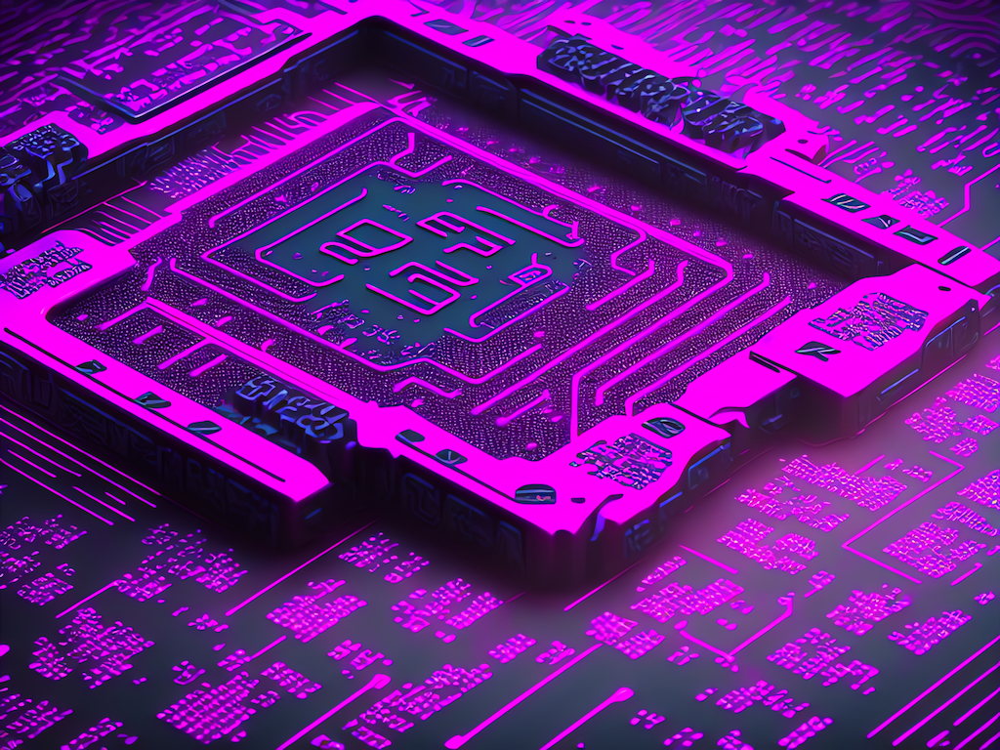
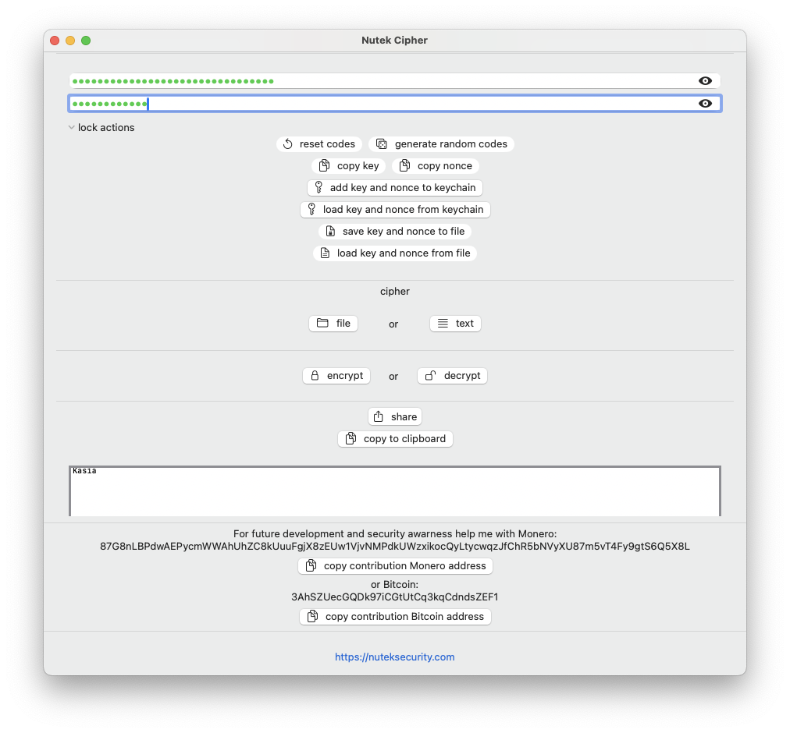

# Nutek Cipher



Encrypt and decrypt files and text with ease.

## setup

```shell
cargo install nutek-cipher
```

or download binary for your OS type from _GitHub_ release page

[GitHub Releases Page](https://github.com/NutekSecurity/nutek-cipher/releases "Release Page")

## Docker/Podman - the safest option for most operating systems

Pull docker image:

```sh
docker pull neosb/nutek-cipher:minimal
```

After this you can start using program with:

```sh
docker run -it -rm -v /path/to/host/folder:/app/directory neosb/nutek-sipher:minimal nutek-cipher --help
```

* `-it` make it interactive
* `-rm` deletes the container after finishing work with `exit`/`ctrl`+`c`
* `-v` attaches file or directory to `/app/directory` in container

## There is also macOS desktop version too!



Look into [GitHub Releases Page](https://github.com/NutekSecurity/nutek-cipher/releases "Release Page") and take a look at
`NutekCipherMacOS.zip`

## usage

```shell
File or text (from standard input) encryption for modern days

Usage: nutek-cipher [OPTIONS]

Options:
  -e, --encrypt                    encrypt
  -d, --decrypt                    decrypt
  -i, --input-file <INPUT_FILE>    input file
  -o, --output-file <OUTPUT_FILE>  output file
      --sum-codes <SUM_CODES>      separated by colon ":" paths to key_path:nonce_path files that will be merged into codes file
      --codes-file <CODES_FILE>    codes from one file in format: key=xxx nonce=yyy
      --display-codes              display codes loaded from file using --codes-file flag and then exit
  -r                               random key and nonce
      --save-codes                 save key and nonce to separete codes file
      --stdout                     print result to stdout
  -h, --help                       Print help
  -V, --version                    Print version
```

## for example:

```shell
echo "hahaha" | nutek-cipher --stdout -e -r --save-codes
```

This will encrypt text hahaha with random key and nonce and save your codes to your user Downloads folder

## cipher in use

This program uses *AES-GCM-SIV* cipher with *32 bytes* key and *12 bytes* nonce. It's enough for home use.

## license

Apache-2.0 or MIT
